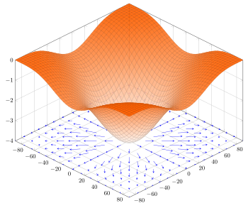

# 导数、偏导数、梯度

## 导数（Derivative）

一个函数在某一点的导数描述了这个函数在这一点附近的变化率。导数的本质是通过极限的概念对函数进行局部的线性逼近。

### 意义：

导数代表了在自变量变化趋于无穷小的时候，函数值的变化与自变量的变化的比值。

#### 物理意义是该时刻的瞬时变化率:

在物理学中有平均速度和瞬时速度之说。平均速度有
$$
v=\frac{s}{t}
$$
其中$v$表示平均速度，$s$表示路程，$t$表示时间。


这个公式可以改写为
$$
\bar{v}=\frac{\Delta s}{\Delta t}=\frac{s(t_0+\Delta t)-s(t_0)}{\Delta t}
$$
其中$\Delta s$表示两点之间的距离，而$\Delta t$表示走过这段距离需要花费的时间。当$\Delta t$趋向于0（$\Delta t \to 0$）时，也就是时间变得很短时，平均速度也就变成了在$t_0$时刻的瞬时速度，表示成如下形式：
$$
v(t_0)=\lim_{\Delta t \to 0}{\bar{v}}=\lim_{\Delta t \to 0}{\frac{\Delta s}{\Delta t}}=\lim_{\Delta t \to 0}{\frac{s(t_0+\Delta t)-s(t_0)}{\Delta t}}
$$


实际上，上式表示的是路程$s$关于时间$t$的函数在$t=t_0$处的导数。一般的，这样定义导数：如果平均变化率的极限存在，即有
$$
\lim_{\Delta x \to 0}{\frac{\Delta y}{\Delta x}}=\lim_{\Delta x \to 0}{\frac{f(x_0+\Delta x)-f(x_0)}{\Delta x}}
$$
则称此极限为函数 $y=f(x)$ 在点 $x_0$ 处的导数。记作 $f'(x_0)$ 或 $y'\vert_{x=x_0}$ 或 $\frac{dy}{dx}\vert_{x=x_0}$ 或 $\frac{df(x)}{dx}\vert_{x=x_0}$。

在直线运动场景中，若x表示时刻，y表示距离，函数f表示时间与距离的关系  $y=f(x)$  ， 那么导数的含义就是在 $x_0$ 时刻的瞬时速度。

#### 几何意义是这个点的切线:

在直角坐标系中，  $y=f(x)$ 表示一条曲线，导数的含义表示的是曲线在点 $x_0$ 处的切线的斜率。


### 定义：

设函数 $y=f(x)$ 在点 $x_0$ 的某个邻域内有定义，若极限
$$
f'(x_0)= lim_{\Delta x \to 0} \frac{\Delta y}{\Delta x}= lim_{\Delta x \to 0} \frac {f(x_0+ \Delta x)-f(x_0)}{\Delta x}
$$
存在，则称函数f（x）在点 $x_0$ 处可导，其极限值称为函数f（x）在 $x_0$ 处的导数，记为
$$
f’(x_0) 或 y'_x |_{x=x_0} ，\frac {dy}{dx} | _{x=x_0},  \frac {df(y)}{dx} | _{x=x_0}
$$
若上述极限不存在，则称函数f(x) 在 $x_0$ 处不可导。

### 常用函数的导数：


## 偏导数(Partial derivative)

在数学中，一个多变量的函数的**偏导数**是它关于其中一个变量的导数，而保持其他变量恒定（相对于全导数，在其中所有变量都允许变化）。

偏导数**至少**涉及到**两个**自变量。以两个自变量为例，$z=f(x,y)$，从导数到偏导数，也就是从曲线来到了曲面。曲线上的一点，其切线只有一条。但是曲面上的一点，切线有无数条。而偏导数就是指多元函数沿着坐标轴的变化率。 

*注意*：直观地说，偏导数也就是函数在某一点上沿坐标轴正方向的的变化率。

假设ƒ是一个多元函数。例如：$z = f(x,y) = x^2 + xy + y^2$ , 

偏导数就是选择其中一条切线，并求出它的斜率。例如，欲求出以上的函数在点（1, 1, 3）的与 xz 平面平行的切线。


我们把变量*y*视为常数，通过对方程求导，我们发现函数 ƒ（x，y）在点（x, y, z）的关于x的切线的斜率方程为：  $ \frac{\partial z}{\partial x} = 2x+y$ 																														

于是在点（1, 1, 3）的与 xz 平面平行的切线的斜率是3。函数ƒ（x，y）在点（1, 1, 3）的关于*x*的偏导数是3。

#### 定义：

设函数$z=f(x,y)$在点$(x_0,y_0)$的领域内有定义，当$y=y_0$时，$z$可以看作关于$x$的一元函数$f(x,y_0)$，若该一元函数在$x=x_0$处可导，即有
$$
\lim_{\Delta x \to 0}{\frac{f(x_0+\Delta x,y_0)-f(x_0,y_0)}{\Delta x}}=A
$$
函数的极限$A$存在。那么称$A$为函数$z=f(x,y)$在点$(x_0,y_0)$处关于自变量$x$的偏导数，记作$f_x(x_0,y_0)$或$\frac{\partial z}{\partial x}\vert_{y=y_0}^{x=x_0}$或$\frac{\partial f}{\partial x}\vert_{y=y_0}^{x=x_0}$或$z_x\vert_{y=y_0}^{x=x_0}$。

偏导数在求解时可以将另外一个变量看做常数，利用普通的求导方式求解，比如$z=3x^2+xy$关于$x$的偏导数就为$z_x=6x+y$，这个时候$y$相当于$x$的系数。

### 导数和偏导数的区别

导数和偏导没有本质区别，如果极限存在，都是当自变量的变化量趋于0时，函数值的变化量与自变量变化量比值的极限。  

> - 一元函数，一个$y$对应一个$x$，导数只有一个。  
> - 二元函数，一个$z$对应一个$x$和一个$y$，有两个导数：一个是$z$对$x$的导数，一个是$z$对$y$的导数，称之为偏导。  
> - 求偏导时要注意，对一个变量求导，则视另一个变量为常数，只对改变量求导，从而将偏导的求解转化成了一元函数的求导。

## 梯度

梯度的本意是一个向量，表示某一函数在该点处的方向导数沿着该方向取得最大值，即函数在该点处沿着该方向变化最快，变化率最大。



例如：在一元函数 f(x) 中，梯度只能沿 x 轴正方向或负方向，而在二元函数 f(x,y) 中，梯度则是一个二维向量 (∂f/∂x,∂f/∂y)。

一元函数的导数表示这个函数图形的切线的斜率，如果多元函数在点 $\displaystyle P$ 上的梯度不是零向量，它的方向是该函数在 $\displaystyle P$ 上的最大增长方向，而它的量是该方向上的增长率。

#### 梯度下降算法

**梯度下降法**（Gradient Descent Optimization）是一个一阶最优化算法。 要使用梯度下降法找到一个函数的局部极小值，必须向函数上当前点对应梯度的**反方向**按规定步长进行迭代搜索。如果相反地向梯度正方向迭代进行搜索，则会接近函数的局部极大值点，这个过程则被称为**梯度上升法**。


# 线性回归（linear regression）

**线性回归**是利用称为线性回归方程的最小二乘函数对一个或多个自变量和因变量之间关系进行建模的一种回归分析。

线性回归输出是一个连续值，因此适用于回归问题。回归问题在实际中很常见，如预测房屋价格、气温、销售额等连续值的问题。与回归问题不同，分类问题中模型的最终输出是一个离散值。我们所说的图像分类、垃圾邮件识别、疾病检测等输出为离散值的问题都属于分类问题的范畴。softmax回归则适用于分类问题。

## 线性回归的基本要素

我们以一个简单的房屋价格预测作为例子来解释线性回归的基本要素。这个应用的目标是预测一栋房子的售出价格（元）。为了简单起见，这里我们假设价格只取决于房屋状况的两个因素，即面积（平方米）和房龄（年）。接下来我们希望探索价格与这两个因素的具体关系。

### 1. 建立模型

设房屋的面积为x1，房龄为x2，售出价格为y。我们需要建立基于输入x1和x2来计算输出y的表达式，也就是模型（model）。顾名思义，线性回归假设输出与各个输入之间是线性关系：


$$
\hat y=x1w1+x2w2+b
$$
其中w1和w2是权重（weight），b是偏差（bias），且均为标量。它们是线性回归模型的参数（parameter）。模型输出y^是线性回归对真实价格y的预测或估计。通常它们之间有一定误差。

### 2. 模型训练

接下来我们需要通过数据来寻找特定的模型参数值，使模型在数据上的误差尽可能小。这个过程叫作模型训练（model training）。下面我们介绍模型训练所涉及的3个要素。

#### 1. 训练数据

我们通常收集一系列的**真实数据**，例如多栋房屋的真实售出价格和它们对应的面积和房龄。我们希望在这个数据上面寻找模型参数来使模型的预测价格与真实价格的误差最小。在机器学习术语里，该数据集被称为**训练数据集**（training data set）或**训练集**（training set），一栋房屋被称为一个**样本**（sample），其真实售出价格叫作**标签**（label），用来预测标签的两个因素叫作**特征**（feature）。特征用来表征样本的特点。

假设我们采集的样本数为 n，索引为i的样本的特征为 $x^{(i)}_1$ 和  $x^{(i)}_2$  ，标签为  $y^{(i)}$。对于索引为 i 的房屋，线性回归模型的房屋价格**预测表达式**为
$$
\hat y^{(i)}=x^{(i)}_1w_1+x^{(i)}_2w_2+b
$$


#### 2. 损失函数

在模型训练中，我们需要衡量价格**预测值与真实值之间的误差**。通常我们会选取一个非负数作为误差，且数值越小表示误差越小。一个常用的选择是**平方函数**（R2 score）。它在评估索引为 i 的样本误差的表达式为
$$
ℓ^{(i)}_{(w1,w2,b)}=\frac12 (\hat y^{(i)}−y^{(i)})^2
$$
显然，误差越小表示预测价格与真实价格越相近，且当二者相等时误差为0。在机器学习里，将衡量误差的函数称为**损失函数**（loss function）。这里使用的平方误差函数也称为平方损失（square loss）。

通常，我们用训练数据集中**所有样本误差的平均**来衡量模型预测的质量，即


在模型训练中，我们希望找出一组模型参数，记为 $w^∗_1,w^∗_2,b^∗$ ，来使训练样本平均损失最小：


#### 3. 优化算法

当模型和损失函数形式较为简单时，上面的误差最小化问题的解可以直接用公式表达出来。这类解叫作**解析解**（analytical solution）。然而，大多数机器学习模型并没有解析解，只能通过**优化算法有限次迭代**模型参数来尽可能降低损失函数的值。这类解叫作**数值解**（numerical solution）。

在求数值解的优化算法中，**小批量随机梯度下降**（mini-batch stochastic gradient descent）在深度学习中被广泛使用。它的算法很简单：先选取一组模型参数的初始值，如随机选取；接下来对参数进行多次迭代，使每次迭代都可能降低损失函数的值。在每次迭代中，先**随机均匀采样**一个由固定数目训练数据样本所组成的小批量（mini-batch）BB，然后求小批量中数据样本的平均损失有关模型参数的导数（梯度），最后用此结果与预先设定的一个正数的乘积作为模型参数在本次迭代的减小量。

在训练本节讨论的线性回归模型的过程中，模型的每个参数将作如下迭代：


在上式中，|B|代表每个小批量中的样本个数（**批量大小**，batch size），η称作**学习率**（learning rate）并取正数。需要强调的是，这里的批量大小和学习率的值是人为设定的，并不是通过模型训练学出的，因此叫作**超参数**（hyperparameter）。我们通常所说的“调参”指的正是调节超参数，例如通过反复试错来找到超参数合适的值。在少数情况下，超参数也可以通过模型训练学出。

### 3. 模型预测

模型训练完成后，我们将模型参数w1,w2,b在优化算法停止时的值分别记作 $\hat w^1,\hat w^2,\hat b$ 。注意，这里我们得到的并不一定是最小化损失函数的最优解 $w^∗_1,w^∗_2,b^∗$ ，而是对最优解的一个近似。然后，我们就可以使用学出的线性回归模型 $x_1 \hat w_1+x_2 \hat w_2+\hat b$ 来估算训练数据集以外任意一栋面积（平方米）为x1、房龄（年）为x2的房屋的价格了。这里的估算也叫作模型预测、模型推断或模型测试。


### 用波士顿房屋数据集做线性回归：

housing.data


### 线性回归案例：

```python
from sklearn.datasets import load_boston
from sklearn.preprocessing import scale
from sklearn.model_selection import train_test_split
X, y = load_boston(True)
X = scale(X)
X_train, X_test, y_train, y_test = train_test_split(X, y, test_size=0.3)
#进行数据归一化处理
from sklearn import preprocessing
#初始化标准化器
min_max_scaler = preprocessing.MinMaxScaler()
#分别对训练和测试数据的特征以及目标值进行标准化处理
X_train=min_max_scaler.fit_transform(X_train)
X_test=min_max_scaler.fit_transform(X_test)

y_train=min_max_scaler.fit_transform(y_train.reshape(-1,1))#reshape(-1,1)指将它转化为1列，行自动确定
y_test=min_max_scaler.fit_transform(y_test.reshape(-1,1))

#使用线性回归模型LinearRegression对波士顿房价数据进行训练及预测
from sklearn.linear_model import LinearRegression
lr=LinearRegression()
#使用训练数据进行参数估计
lr.fit(X_train,y_train)
#回归预测
y_predict=lr.predict(X_test)
#模型评估
from sklearn.metrics import r2_score
score = r2_score(y_test, y_predict)
print(score)

# 画出真实值和预测值之间的关系图
import matplotlib.pyplot as plt  

plt.scatter(y_predict,y_test ) 
y_ = y_predict.reshape(-1,1)   
lr.fit(y_, y_test)                
y = lr.predict(y_)                
plt.xlabel('Predicted Prices')    
plt.ylabel('Real Prices')         
plt.plot(y_, y)                   
plt.show()                                          
```

### 岭回归（Ridge）：

```python
from sklearn.datasets import load_boston
from sklearn.preprocessing import scale
from sklearn.model_selection import train_test_split
X, y = load_boston(True)
X = scale(X)
X_train, X_test, y_train, y_test = train_test_split(X, y, test_size=0.3)

from sklearn.linear_model import Ridge
from sklearn.metrics import r2_score
ridge=Ridge()
y_pred_ridge = ridge.fit(X_train, y_train).predict(X_test)
r2_score_ridge = r2_score(y_test, y_pred_ridge)
print(r2_score_ridge)
```

